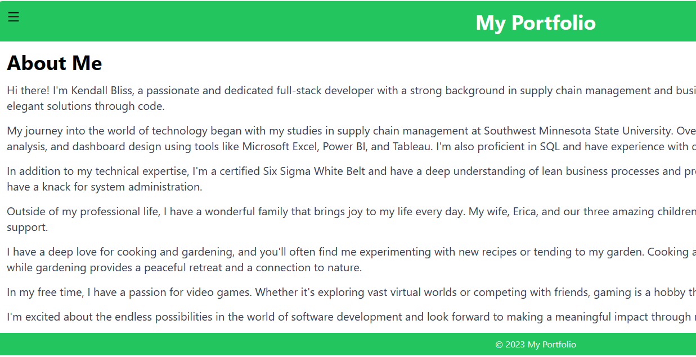

# 20 React Portfolio

## Screenshot

## Description
This project is designed to demonstrate my ability to create an application using vite/react. It is a showcase of my current skills in coding bootcamp.

## Table of Contents
  - [Installation](#installation)
  - [Usage](#usage)
  - [Contribution](#contribution)
  - [Testing](#testing)
  - [License](#license)
  - [Links](#Links)

 ## Installation 
 To install this application, git clone thie repository to your local computer. The user must also install Node.js in order to use this application.

 ## Usage
This application is deployed to netlify, you can follow the link below to navigate to the site.

## Contribution
This application is homework for Northwest Coding Bootcamp and is complete, there is no need for any contributions.

## Testing
You can test this application  by running the command line prompt "npm start" after installing the required node packages from VS code and using live preview to demo the pwa.

## Licenses
This project is covered under the MIT License
https://opensource.org/licenses/MIT

## Links
Git Hub: https://github.com/kbliss86/react-portfolio

Deployed Site: https://thriving-platypus-d706a2.netlify.app/
