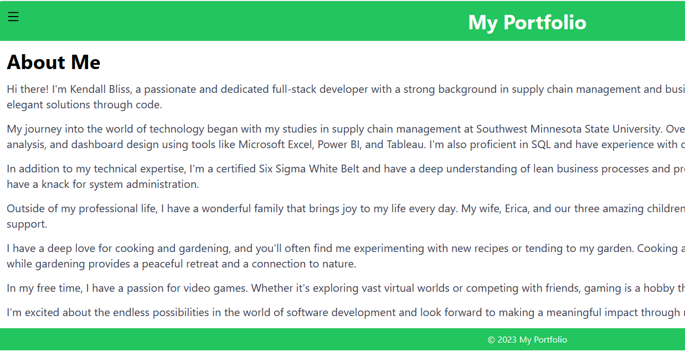

# 20 React Portfolio

## Screenshot

## Description
This project is designed to demonstrate my ability to create an application using vite/react. It is a showcase of my current skills in coding bootcamp.

## Table of Contents
  - [Future Developemt](#future-projectsimprovements)
  - [Installation](#installation)
  - [Usage](#usage)
  - [Contribution](#contribution)
  - [Testing](#testing)
  - [License](#license)
  - [Links](#Links)

## Future Projects/Improvements

- **Change URL Link for the Cards on Portfolio**: Update the links so that clicking anywhere on the card (not just the picture) navigates to the deployed site.

  - **How to achieve this**: Modify the HTML structure of the cards to wrap the entire card content in an anchor (`<a>` tag). Update the CSS to ensure that clicking any part of the card triggers the link, making the entire card clickable.
  - **Testing**: Manually test each card to verify that clicking anywhere redirects to the appropriate link. Ensure that there are no conflicts with other clickable elements inside the card.

- **Create a Database Connection (Mongo)**: Set up a connection to a MongoDB database for storing portfolio data.

  - **How to achieve this**: Use MongoDB Atlas to create a cloud-hosted database, or set up a local MongoDB instance. Install Mongoose for easy interaction with the MongoDB database. Define schemas for different data types like projects and blog posts.
  - **Implementation steps**:
    1. Install Mongoose (`npm install mongoose`).
    2. Create a `.env` file to store your MongoDB URI.
    3. Set up a connection using Mongoose (`mongoose.connect()` in a server-side file).
    4. Define models for the different types of data (e.g., Project, Blog).
  - **Testing**: Write scripts to add and retrieve sample data to ensure the connection works correctly.
  - Verify if something has to be done on the netlify site to achieve this

- **Create CRUD Elements (Possible Next.js)**: Implement CRUD operations to allow data to be written to and retrieved from the database.

  - **How to achieve this**: Create API routes in a Next.js app to handle Create, Read, Update, and Delete (CRUD) operations for blog posts and project data.
  - **Implementation steps**:
    1. Create RESTful API routes or GraphQL endpoints in your Next.js app.
    2. Use Mongoose to interact with your MongoDB database in these routes.
    3. Develop forms on the front-end to allow users to create or edit content.
    4. Implement client-side data fetching using `fetch` or `axios` to interact with your API routes.
  - **Testing**: Test each operation (Create, Read, Update, Delete) individually to ensure the correct functioning of data interactions.

- **Create Interface to Write and Store Blogs**: Develop an interface for writing and storing blog posts. Display the latest 3 blogs by default and provide a search feature by blog title and category.

  - **How to achieve this**: Create a blog form page that allows users to write and save posts. Use MongoDB to store blog data.
  - **Implementation steps**:
    1. Create a `Blog` model with fields for title, content, category, and date.
    2. Develop a front-end form that interacts with your API to submit new blog posts.
    3. On the blog landing page, fetch and display the latest 3 posts by default.
    4. Add a search feature that allows users to filter blog posts by title or category using a search input.
  - **Testing**: Test creating, saving, and displaying blogs. Ensure that the search functionality correctly filters blogs based on user input.

- **Referral Link Handling for Blog Navigation**: Add functionality to detect referral links and automatically load the correct blog post when navigating to the site. Implement a script to check referral URLs and store them in session storage.

  - **How to achieve this**: Use JavaScript to parse the URL for referral parameters and save these in session storage if they exist.
  - **Implementation steps**:
    1. Write a JavaScript function that runs on page load to check for referral parameters in the URL (`window.location.search`).
    2. If a referral is detected, save it to `sessionStorage`.
    3. When loading the blog page, check `sessionStorage` for any stored referral information and use it to load the correct blog post.
  - **Testing**: Simulate different referral links and ensure the correct blog posts are loaded as expected. Test different browsers to ensure compatibility.

- **Connect Email Service to Contact Form**: Integrate an email service to handle contact form submissions.

  - **How to achieve this**: Use an email API like EmailJS, SendGrid, or Nodemailer to send form submissions directly to your email.
  - **Implementation steps**:
    1. Choose an email service provider (e.g., EmailJS for a client-side solution, Nodemailer for server-side).
    2. Create a form on the contact page that captures user details (name, email, message).
    3. Write a function to handle form submissions and trigger an email using the chosen service.
  - **Testing**: Test the form by submitting multiple entries to ensure emails are received correctly. Validate error handling for failed submissions.

 ## Installation 
 To install this application, git clone thie repository to your local computer. The user must also install Node.js in order to use this application.

 ## Usage
This application is deployed to netlify, you can follow the link below to navigate to the site.

## Contribution
This application is homework for Northwest Coding Bootcamp and is complete, there is no need for any contributions.

## Testing
You can test this application  by running the command line prompt "npm start" after installing the required node packages from VS code and using live preview to demo the pwa.

## Licenses
This project is covered under the MIT License
https://opensource.org/licenses/MIT

## Links
Git Hub: https://github.com/kbliss86/react-portfolio

Deployed Site: https://thriving-platypus-d706a2.netlify.app/
